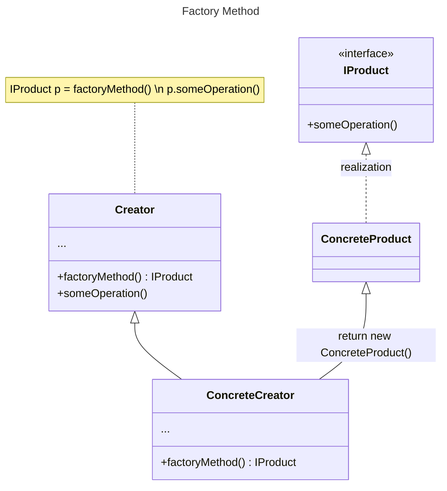
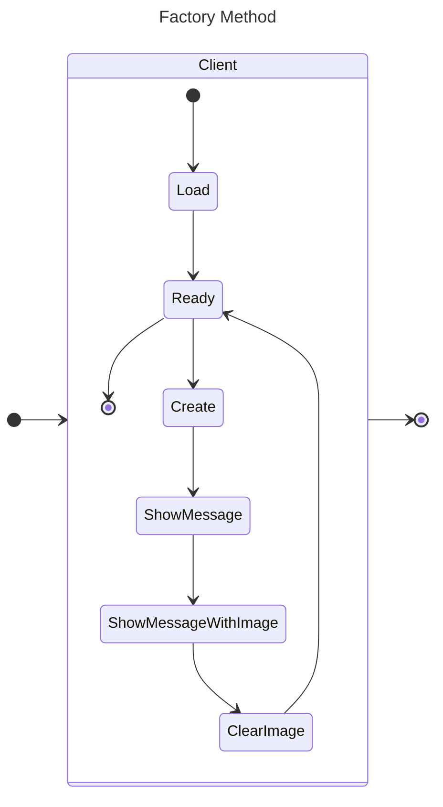

****
# :star2:  `Factory method`

### :black_nib:	Призначення та застосування шаблону
##### **Фабричний метод** — це породжувальний патерн проектування, який визначає загальний інтерфейс для створення об’єктів у батьківському класі, дозволяючи підкласам змінювати тип створюваних об’єктів.
Цей шаблон є прикладом реалізації **Open-Closed Principle SOLID**, бо клас Творець відкритий для розширення (додавання продуктів), але закритий для зміни.
##### **Застосовується для :**
- *Гнучкості*, коли необхідно дозволити введення нових класів без зміни існуючого коду;
- *Відокремлення коду клієнта від конкретних класів, екземпляри яких він створює.* Замість створення об’єкта за допомогою конструктора клієнтський код покладається на інтерфейс з фабричним методом, тож зміни конкретних класів не впливають на код клієнта.
- *Розширюваності частини фреймворку чи бібліотеки.* Якщо є ієрархія класів і необхідно делегувати відповідальність за створення екземплярів об’єктів підкласам, вони можуть забезпечувати власну реалізацію фабричного методу для створення об’єктів, дотримуючись загальної структури, визначеної батьківським класом.
- *Економлення системних ресурсів.* Замість того, щоб безпосередньо створювати об’єкти, клас покладається на фабричний метод для отримання екземплярів своїх залежностей. Це полегшує заміну залежностей або налаштування системи з різними реалізаціями, не змінюючи клас, який їх використовує.

### Діаграма класів та стану

##### Class Diagram Factory Method:

##### State Diagram Factory Method:

### Опис основних структурних елементів :
- **Product** - загальний інтерфейс об’єктів, які може створювати творець та його підкласи;
- **ConcreteProduct** містить код різних продуктів. Відрізнятимуться реалізацією, але інтерфейс у них буде спільним;
- **Creator** (інтерфейс або абстрактний клас) оголошує фабричний метод, який має повертати нові об’єкти продуктів. Важливо, щоб тип результату цього методу співпадав із загальним інтерфейсом продуктів.
- **ConcreteCreator** по-своєму реалізує фабричний метод, виробляючи ті чи інші конкретні продукти.
##### На діаграмі стану можна побачити конкретні класи по шаблону Factory method.

### Джерела інформації
##### - [refactoring.guru](https://refactoring.guru/design-patterns/factory-method)
##### - [blog.stackademic.com](https://blog.stackademic.com/design-patterns-factory-method-2f7b0733286d)
##### - [www.baeldung.com](https://www.baeldung.com/java-factory-pattern)
****
